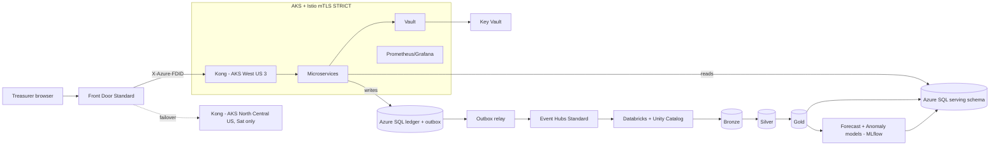
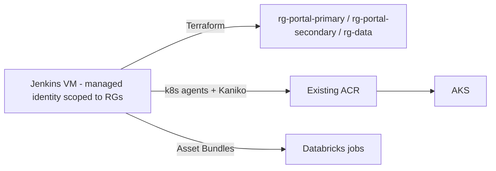

# Architecture Diagrams

## Runtime

```mermaid
flowchart LR
  U[Treasurer browser] --> FD[Front Door Standard]
  FD -->|X-Azure-FDID| K1[Kong - AKS West US 3]
  FD -.->|failover| K2[Kong - AKS North Central US, Sat only]
  subgraph AKS[AKS + Istio mTLS STRICT]
    K1 --> SVC[Microservices]
    SVC --> V[Vault]
    P[Prometheus/Grafana]
  end
  V --> KV[Key Vault]
  SVC -->|writes| SQL[(Azure SQL ledger + outbox)]
  SVC -->|reads| SRV[(Azure SQL serving schema)]
  SQL --> OR[Outbox relay] --> EH[Event Hubs Standard]
  EH --> DBX[Databricks + Unity Catalog]
  DBX --> B[(Bronze)] --> S[(Silver)] --> G[(Gold)]
  G --> ML[Forecast + Anomaly models - MLflow]
  G --> SRV
  ML --> SRV
```

## Build and provisioning

```mermaid
flowchart LR
  J[Jenkins VM - managed identity scoped to RGs] -->|Terraform| AZ[rg-portal-primary / rg-portal-secondary / rg-data]
  J -->|k8s agents + Kaniko| ACR[Existing ACR]
  J -->|Asset Bundles| DBX[Databricks jobs]
  ACR --> AKS[AKS]
```
